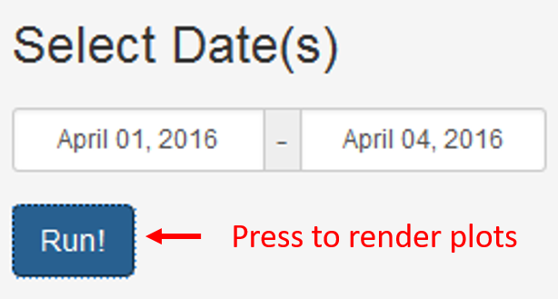
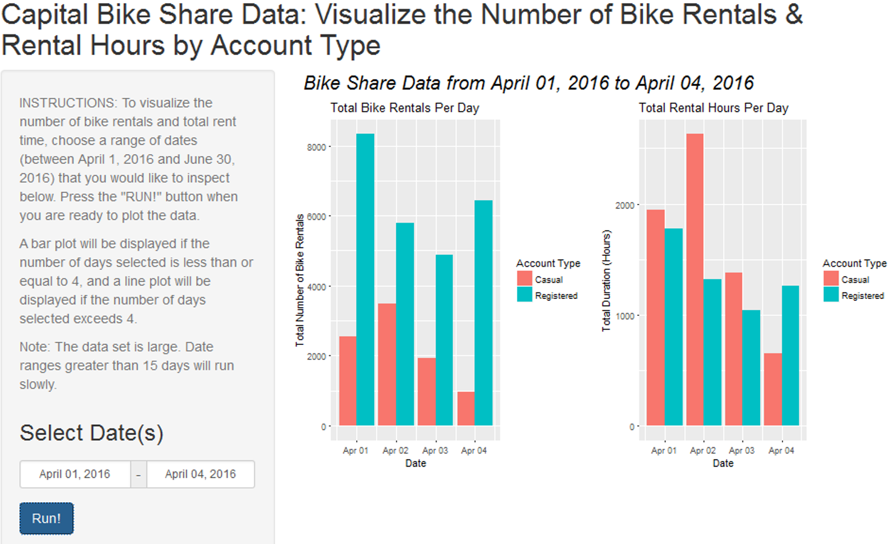
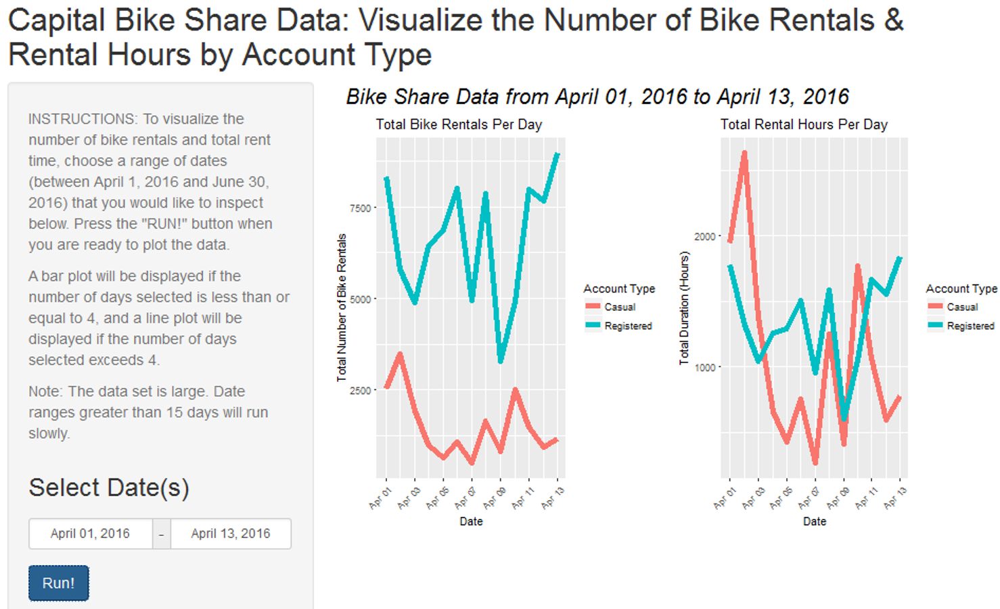

## Presentation Outline
The following slides are arranged as follows:

- Introduction to the app

- Instructions

- Image of the app when fewer than 5 days are selected

- Image of the app when more than 4 days are selected

- Links to the app and Github repository containing the associated
server.R file and ui.R file

--- .class #outline

## Introduction
The Capital Bike Share Shiny App visualizes the frequency and total hours in which bikes were rented under the [Capital Bike Share program] (https://www.capitalbikeshare.com/) in Washington, D.C.

The data is provided by the bike share program on their [website](https://www.capitalbikeshare.com/system-data). The data sets are
large, so only one reported annual quarter (quarter #2 from April 1, 2016 to
June 30, 2016) was used.

--- .class #intro &twocol w1:40% w2:60%

## Instructions
*** =left
To use this app, select a range of dates, between April 1, 2016 and June 30, 2016
in which you would like to examine. Hit the "RUN!" button to plot the total
number of bike rentals and the total number of hours used during rentals across
different account types, casual and registers.

Helper instructions are located at the top of the side bar panel.

WARNING: It may take upwards of 20-30 seconds for the figures to render.

*** =right
</img>

--- .class #instructions

## If fewer than 5 days are selected...
a bar plot will be generated.
 
 

    </img>

--- #barPlot

## If more than 4 days are selected...
a line plot will be generated.
 
 

    </img>

--- #linePlot

## Project Links
Capital Bike Share Shiny App: https://ssylvest00.shinyapps.io/CapitalBikeShareApp/

Shiny R files: LINKLINKLINK