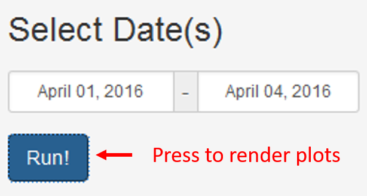

## Introduction
The Capital Bike Share Shiny App visualizes the frequency and total hours in which 
bikes were rented under the [Capital Bike Share program] (https://www.capitalbikeshare.com/) in Washington, D.C.

 

The data can be accessed via the bike share [website](https://www.capitalbikeshare.com/system-data). The data sets are
large, so only one reported annual quarter (quarter #2 from April 1, 2016 to
June 30, 2016) was used.

 

The data set includes a record of every rental purchased for each day in the second quarter of the year.
To generate the figures for this app, the number of rentals as well as the total amount of time bikes were rented is computed across 
a user defined range of dates. This information is displayed as either a time series line plot or a bar plot depending upon
the number of days selected.

--- .class #intro &twocol w1:40% w2:60%

## Instructions
*** =left
To use this app, select a range of dates, between April 1, 2016 and June 30, 2016
in which you would like to examine. Hit the "RUN!" button to plot the total
number of bike rentals and the total number of hours used during rentals across
different account types, casual and registers.

Helper instructions are located at the top of the side bar panel.

WARNING: It may take upwards of 20-30 seconds for the figures to render.

*** =right
</img>

--- .class #instructions

## Changes in graph presentation based upon date selection

If fewer than 5 days are selected, a bar plot will be displayed (top row). Otherwise, the computations
will be displayed as a time series line plot (bottom row).

--- #plots

## Project Links

- Capital Bike Share Shiny App: 
https://ssylvest00.shinyapps.io/CapitalBikeShareApp/

- Shiny R files in Github repo: 
https://github.com/sylvest00/DDP/tree/master/CapitalBikeShareApp
